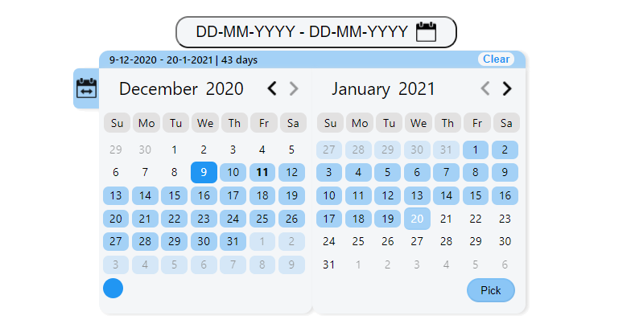

<div align="center">
	<br>
	<a href="https://raw.githubusercontent.com/sindresorhus/css-in-readme-like-wat/main/readme.md">
		
	</a>
	<br>
</div>

<sup>
    <br />

<p align='center'>
  <a href="https://www.npmjs.com/package/dates-picker"></a>
  <p align='center'>⚛️📆 Flexible React date range picker calendar with no dependencies</p>
</p>
    <br />
    <br />
</sup>



## Demo

Demo page at <https://almogtavor.github.io/date-range-picker/>

<details>
  <summary>Read More</summary>
  
## Main Features

* Pick method - an option of configuring the component to be date picker, range picker, or ranges picker.
* Days amount tab - an option of selecting a number of days backward from the current date immediately by choosing a number.
* Colors palette - an option of determining the component's color (can be disabled removed).
* Language - English and Hebrew support.
* Select all button - an option of selecting all of the current board's dates. Whether viewing dates, months, or years.
* Boards number - an option of configuring components to be in one board or two boards.

## Installation

```sh
$ npm i dates-picker
```

## Usage

```javascript
function callbackFunction(dates) {
    console.log(`The range of dates that got picked is: ${dates.text}`);
    console.log(`The min date that got picked is: ${dates.minDate}`);
    console.log(`The max date that got picked is: ${dates.maxDate}`);
    console.log(`The number of days that got picked is: ${dates.numberOfDaysPicked}`);
    console.log(`All dates: ${dates.allDates}`);
}

function MyComponent() {
    return (
      <DateRangePicker 
        callback={callbackFunction}
      />
    )
  }
}
```

## Options

Property                             | Type      | Allowed Values   | Default Value        | Description
-------------------------------------|-----------|------------------|----------------------|-----------------------------------------------
language                             | String    | `English`, `Hebrew` | `English`        | component's language. currently support English and Hebrew. Notice Languages such Hebrew changes the whole component from left to right to right to left.
colorsPalette                        | String    | `enabled`, `disabled` | `enabled` | by enabling colors palette you can choose the component's color.
format                               | String    | any combination of 2 Ds, 2 Ms and 2\4 Ys with other | `DD-MM-YYYY` | the format of the dates.
selectAllButton                        | String    | `enabled`, `disabled` | `enabled`| depends on current board's view (dates, months, or years), select all enabled items.
startDate                        | date | date object | `new Date(1900, 0, 0)` | calendar's start date.
endDate                        | date | date object | `new Date(2025, 0, 0)` | calendar's end date.
firstDayOfWeekIndex                        | int    | 0 - 6 | 0 (sunday) | first day of the week (etc monday, sunday).
pickMethod                        | String    | `date`, `range`, `ranges` | `range` | date means picking one day (on one board). range is to peak dates two dates. ranges is to pick an array of ranges (with view option on hover).
defaultColor                        | String    | any color format item | `#2196f3` | default component's color. becomes the first option on colors palette.
daysAmountTab                        | String    | `enabled`, `disabled` | `disabled` | by enabling, there will be a button on the left that you can open and choose prepared range, or days amount up to today.
boardsNum                        | int  | 1, 2 | 2 | by specifing you can choose the component's boards number.

## Future Plans

* Add simple and intuitive time picker option (by list\ or visual clock\ both).
* Tooltips for buttons explanation (for example on select all button).
* On non-component-screen click, close component.
* Go back button on non-dates mode (or on all modes for previous). When the user is in month's or year's mode, add an option to return to dates mode without choosing any value.
* Component & button sizes parameters
* Border radius parameter
* An option to cancel picked range from the input label
</details>
